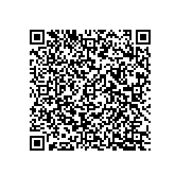

#+TITLE: Machine Learning and Data Mining
#+AUTHOR: Christos Dimitrakakis
#+EMAIL:christos.dimitrakakis@unine.ch
#+LaTeX_HEADER: \usepackage{tikz}
#+LaTeX_HEADER: \usepackage{amsmath}
#+LaTeX_HEADER: \usepackage{amssymb}
#+LaTeX_HEADER: \usepackage{isomath}
#+LaTeX_HEADER: \usepackage{fontawesome}
#+LaTeX_HEADER: \newcommand \E {\mathop{\mbox{\ensuremath{\mathbb{E}}}}\nolimits}
#+LaTeX_HEADER: \newcommand \Var {\mathop{\mbox{\ensuremath{\mathbb{V}}}}\nolimits}
#+LaTeX_HEADER: \newcommand \Bias {\mathop{\mbox{\ensuremath{\mathbb{B}}}}\nolimits}
#+LaTeX_HEADER: \newcommand\ind[1]{\mathop{\mbox{\ensuremath{\mathbb{I}}}}\left\{#1\right\}}
#+LaTeX_HEADER: \renewcommand \Pr {\mathop{\mbox{\ensuremath{\mathbb{P}}}}\nolimits}
#+LaTeX_HEADER: \DeclareMathOperator*{\argmax}{arg\,max}
#+LaTeX_HEADER: \DeclareMathOperator*{\argmin}{arg\,min}
#+LaTeX_HEADER: \DeclareMathOperator*{\sgn}{sgn}
#+LaTeX_HEADER: \newcommand \defn {\mathrel{\triangleq}}
#+LaTeX_HEADER: \newcommand \Reals {\mathbb{R}}
#+LaTeX_HEADER: \newcommand \Param {\Theta}
#+LaTeX_HEADER: \newcommand \param {\theta}
#+LaTeX_HEADER: \newcommand \vparam {\vectorsym{\theta}}
#+LaTeX_HEADER: \newcommand \mparam {\matrixsym{\Theta}}
#+LaTeX_HEADER: \newcommand \bW {\matrixsym{W}}
#+LaTeX_HEADER: \newcommand \bw {\vectorsym{w}}
#+LaTeX_HEADER: \newcommand \wi {\vectorsym{w}_i}
#+LaTeX_HEADER: \newcommand \wij {w_{i,j}}
#+LaTeX_HEADER: \newcommand \bA {\matrixsym{A}}
#+LaTeX_HEADER: \newcommand \ai {\vectorsym{a}_i}
#+LaTeX_HEADER: \newcommand \aij {a_{i,j}}
#+LaTeX_HEADER: \newcommand \bX {\matrixsym{X}}
#+LaTeX_HEADER: \newcommand \bx {\vectorsym{x}}
#+LaTeX_HEADER: \newcommand \bel {\beta}
#+LaTeX_HEADER: \newcommand \Ber {\textrm{Bernoulli}}
#+LaTeX_HEADER: \newcommand \Beta {\textrm{Beta}}
#+LaTeX_HEADER: \newcommand \Normal {\textrm{Normal}}
#+LaTeX_CLASS_OPTIONS: [smaller]
#+COLUMNS: %40ITEM %10BEAMER_env(Env) %9BEAMER_envargs(Env Args) %4BEAMER_col(Col) %10BEAMER_extra(Extra)
#+TAGS: activity advanced definition exercise homework project example theory code
#+OPTIONS:   H:3

* The problems of Machine Learning (1 week)
** Introduction
*** Machine Learning And Data Mining
**** \faGear \faWrench The nuts and bolts 
- Models 
- Algorithms
- Practice
**** \faList Workflow 
- Scientific question and Formalisation
- Data collection
- Analysis and model selection
**** Types of \faBarChart \quad statistics / \faMagic \quad machine learning problems  
- *Classification*
- *Regression*
- Density estimation
- Reinforcement learning
*** Machine learning
**** Data Collection
- Downloading a clean dataset from a *repository*
- *Scraping* data from the web
- Conducting a *survey*
- Performing *experiments*, and obtaining measurements.
**** Modelling
- Simple: the bias of a coin
- Complex:  a language model.
- The model depends on the data and the problem
**** Algorithms and Decision Making
- We want to use models to make decisions.
- Decisions are made every step of the way.
- Both humans and algorithms can make decisions.
  

*** The need to learn from data
**** Problem definition
- What problem do we need to solve?
- How can we formalise it?
- What properties of the problem can we learn from data?

**** Data collection
- *Why* do we need data?
- *What* data do we need?
- How *much* data do we want?
- *How* will we collect the data?

**** Modelling and decision making
- How will we *compute* something useful?
- How can we use the model to make *decisions*?

* Estimation
** Answering a scientific problem
*** Problem definition
- Example: Health, weight and height
****  Health questions regarding height and weight :B_example:
     :PROPERTIES:
     :BEAMER_env: example
     :END:
- What is a normal height and weight?
- How are they related to health?
- What variables affect height and weight?
**** Define a research question                                :B_alertblock:activity:
:PROPERTIES:
:BEAMER_env: alertblock
:END:
Find a *non-sensitive* variable that we can easily measure via a survey, e.g. related to sleep, smoking, exercise, food, politics, sports, hobbies etc.
- Discuss in small groups and post suggestions
- We then vote for what to measure
  
*** Data collection :activity:

Think about *which variables* we need to collect to answer our *research question*.

**** Necessary variables
The variables we need to know about
- Weight
- Height
- Dependent: (health/vote/opinion/salary)
**** Auxiliary variables
Measurable factors related to the variables of interest

**** Possible confounders
Hidden factors that might affect variables.

*** Class data and variables                                       :activity:
- The class enters their data into the [[https://docs.google.com/spreadsheets/d/1Z-NwerJVY9SpTYBgPnpsmajTS4YrEC0Lr4yQcZKQKK0/edit?usp=sharing][excel file]].
#+ATTR_LATEX: :width 0.3\textwidth
  
- Pay attention to the variables we wish to measure

**** Privacy                                                   :B_alertblock:
:PROPERTIES:
:BEAMER_env: alertblock
:END:
- Is the use of a pseudonym sufficient to hide your identity?

*** Variables
The class data looks like this
|------------+--------+--------+--------+-----+-------------+---------|
| First Name | Gender | Height | Weight | Age | Nationality | Smoking |
|------------+--------+--------+--------+-----+-------------+---------|
| Lee        | M      |    170 |     80 |  20 | Chinese     |      10 |
| Fatemeh    | F      |    150 |     65 |  25 | Turkey      |       0 |
| Ali        | Male   |    174 |     82 |  19 | Turkish     |       0 |
| Joan       | N      |   5'11 |    180 |  21 | American    |       4 |
|------------+--------+--------+--------+-----+-------------+---------|

- $\bX$: Everybody's data
- $x_t$: The t-th person's data
- $x_{t,k}$: The k-th feature of the \(t\)-th person.
- $\bx_k$: Everybody's k-th feature
- *Anything strange with this data*?

**** Raw versus neat data
- Neat data: $x_t \in \Reals^n$
- Raw data: web pages, handwritten text, graphs, data packets, missing/incorrect values, etc
  
*** Types of learning problems
**** Unsupervised learning (unconditional estimation)
- Predict the \alert{gender} of an unknown individual.
- Predict the \alert{height}.
- Predict the \alert{height and weight}?
#+BEAMER: \pause

**** Supervised learning problems (conditional estimation)
- Classification: Can we predict gender from height/weight?
- Regression: Can we predict weight from height and gender?
- In both cases we _predict_ *output* variables from *input* variables

#+BEAMER: \pause

**** Variables
- *Input* variables: aka features, predictors, independent variables
- *Output* variables: aka response, dependent variables, labels, or targets.
- The input/output dichotomy only exists in *some prediction problems*.

    
** Course summary

*** Course Contents

**** Models
- k-Nearest Neighbours.
- Linear models and perceptrons.
- Multi-layer perceptrons (aka deep neural networks).
- Bayesian Networks
**** Algorithms
- (Stochastic) Gradient Descent.
- Bayesian inference.
  
**** Reproducibility
- Modelling assumptions
- Interactions and feedback
**** Fairness
- Implicit biases in training data
- Fair decision rules and meritocracy
**** Privacy
- Accidental data disclosure
- Re-identification risk

*** Course material
**** Books
- Introduction to Statistical Learning with Python
https://hastie.su.domains/ISLP/ISLP_website.pdf
- Mathematics for Machine Learning
https://mml-book.github.io/
- Probabilistic machine learning: An introduction
  https://probml.github.io/pml-book/book1.html
**** Additional references
- Probabilistic machine learning: Advanced topics  https://probml.github.io/pml-book/book2.html
- Machine learning in science and society (draft)
https://github.com/olethrosdc/ml-society-science/blob/master/book.pdf
**** Course github
- https://github.com/olethrosdc/machine-learning-neuch
*** Course structure
**** Class time
- Lectures with demos and activities
- Lab practice
- Group work
**** Assessment
- Class work and assignments (20%)
- Quizzes (20%)
- Exam (60%)
**** Communication
- ILIAS Forum for *technical* questions
- Email for *personal* questions
- Office hours Thursday 13:15-14:00 (by appointment)

*** Course contents
**** Theory
- Estimation
- Learning and generalisation
**** Algorithms and Models
- Bayesian networks and Bayesian inference
- Neural networks and stochastic gradient descent
**** Social & Scientific Aspects
- Reproducibility
- Fairness
- Privacy

